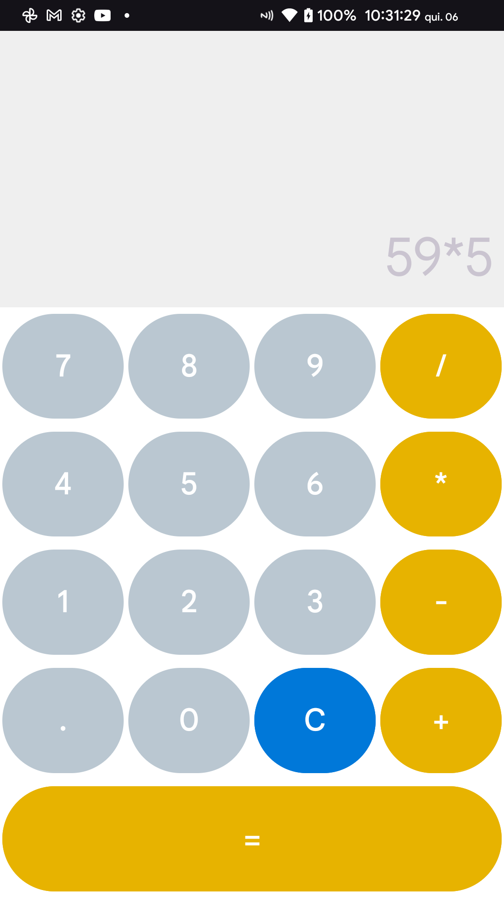

# QuizApp
Aplicativo Android de calculadora

## Objetivo
Realizar cálculos básicos matemáticos

## Funcionalidades
- Subtrair
- Somar
- Multiplicar
- Dividir
- Limpar resultado

## Linguagem
- Kotlin 
- XML

## Screenshots
   
